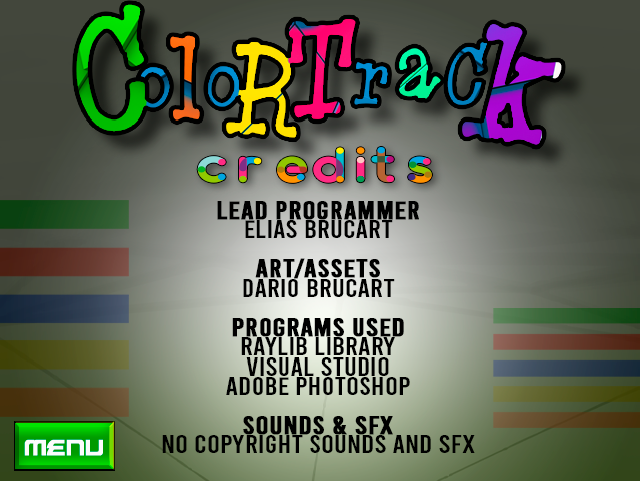

	

# Colortrack
Colortrack is a hypercasual 2D video game based on geometric shapes and Colors!
Go as far as you can! Avoid enemy figures of different colors and collide with figures of the same color as your square to score points, the more points you get, the faster you run!

 # Some Screenshots of the videogame
 
 
Menu

	

 
Tutorial

	

 
Credits

	

 
Gameplay

	

 
GameOver

	

# Credits

Game developed by:

Elias Brucart

Elias Brucart Email: <a href="mailto:eliasbrucart@hargames.com.ar">eliasbrucart@hargames.com.ar</a>

Art & Assets Design

Dario Brucart

Dario Brucart Email: <a href="mailto:dabrucart@yahoo.com.ar">dabrucart@yahoo.com.ar</a>

# Developing

Game version: 1.0

Colortrack will follow a development line. In the future the video game will be more developed and it will be even more fun!

Product developed for HardGames | website: <a href="http://hardgames.com.ar/" target="_blank">www.hardgames.com.ar</a>
Soon it will be available on the official website

# Links

This video game is also available on itch.io: <a href="https://eliasbrucart.itch.io/colortrack">https://eliasbrucart.itch.io/colortrack</a>
